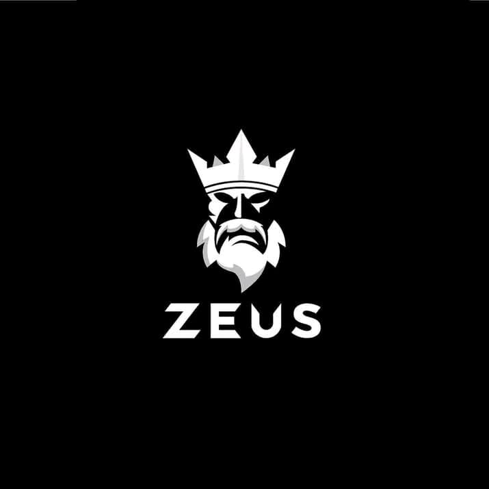

<p align="center">
  
</p>

<h1 align="center">⚡ ZEUS UI — Next.js Starter Project</h1>

<p align="center">
  Dark mode. Heroic theme. Lightning-fast development.
</p>

<p align="center">
  <a href="https://nextjs.org">
    
  </a>
  <a href="https://vercel.com">
    
  </a>
  <a href="LICENSE">
    
  </a>
</p>

---

## 🖥️ Demo

Coming soon... (Add screenshots or [live demo link](https://your-live-url.vercel.app) here)

---

## 🚀 Getting Started

First, run the development server:

    ```bash
      npm run dev
      # or
      yarn dev
      # or
      pnpm dev
      # or
      bun dev

## 🔥 Getting Started

  Open your browser at:  
  👉 [http://localhost:3000](http://localhost:3000)
  
  Modify the homepage at `app/page.tsx`. Hot reload is enabled.
  
Font: **[Geist](https://vercel.com/font)** is optimized using [`next/font`](https://nextjs.org/docs/app/building-your-application/optimizing/fonts).

---

## 🎨 ZEUS Color Palette – Heroic Theme (Dark Mode)

| Role            | Hex Code  | Description                          |
|-----------------|-----------|--------------------------------------|
| Primary Black   | `#000000` | Dominant background color            |
| Zeus White      | `#FFFFFF` | Logo and high-contrast typography    |
| Steel Gray      | `#5B5B5B` | Secondary text and muted accents     |
| Charcoal Gray   | `#1A1A1A` | Section backgrounds and hover states |
| Shadow Silver   | `#B3B3B3` | Subheadings and border lines         |

### ✅ Usage Recommendations

- **Background**: `#000000` (pure black)  
- **Headings / Primary Text**: `#FFFFFF`  
- **Secondary Text**: `#B3B3B3` or `#5B5B5B`  
- **Buttons**: Black with white text or vice versa  
- **Hover Effects**: Use `#1A1A1A` or subtle shadows  
- **Borders / Dividers**: `#2C2C2C` or `#5B5B5B`

---

## 🧱 Project Structure

```bash
/
├── app/
│   └── page.tsx       # Main entry page
├── public/            # Static assets (logo, images)
├── styles/            # Global styles
├── components/        # Reusable UI components
├── README.md          # You're here!
└── next.config.js     # Next.js configuration
